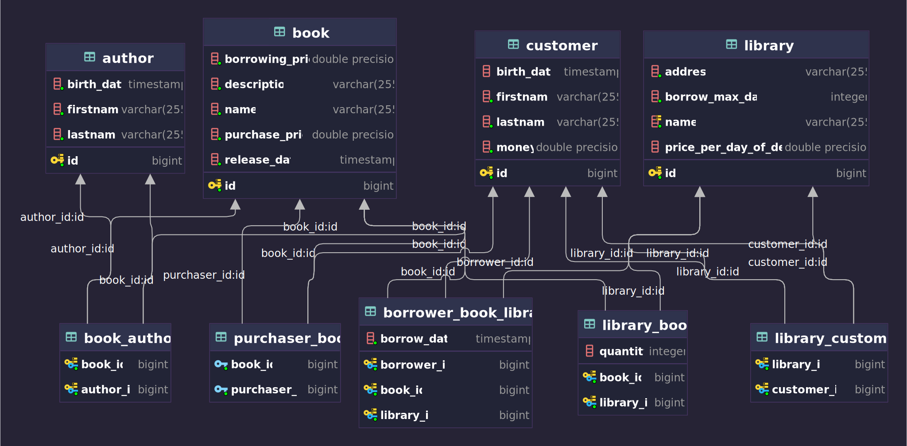

> Project to test spring integration flows

## Business rules

- To add a book, the author must be specified and must exist
- We can add multiple copies of a book to a library, the book and the library must exist
- A book can be borrowed by a customer in a library only if
  - the customer is registered as a customer of the library
  - there are enough copies of the book available in the library
  - the customer has no more than 5 books borrowed
- A customer can bring back a book that he borrowed
  - if he returns the book late, the amount set by the library per day of delay will be removed from his wallet
- A customer can buy a book if
  - the customer is registered as a customer of the library
  - there are enough copies of the book available in the library
  - he has enough money for that

## DB schema

